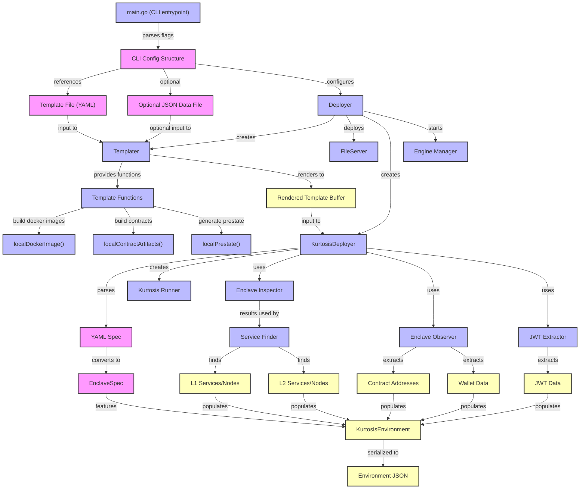

# Standard Output Format

Kurtosis-devnet is tightly integrated with the [Optimism Devnet SDK](/devnet-sdk/). This integration is achieved through a standardized devnet descriptor format that enables powerful testing and automation capabilities.

## Accessing the Devnet Descriptor

The devnet descriptor is available in two ways:

1. **Deployment Output**
   - When you run any of the deployment commands (`just devnet ...`), the descriptor is printed to stdout
   - The output is a JSON file that fully describes your devnet configuration
   - You can capture this output for later use or automation

2. **Kurtosis Enclave Artifact**
   - The descriptor is also stored as a file artifact named "devnet" in the Kurtosis enclave
   - This allows other tools and services to discover and interact with your devnet
   - The descriptor can be accessed through devnet-sdk using the Kurtosis URL format: `kt://<enclave-name>/files/devnet`

Here's a simplified example of a devnet descriptor:

```json
{
  "l1": {
    "name": "Ethereum",
    "nodes": [
      {
        "services": {
          "cl": {
            "name": "cl-1-lighthouse-geth",
            "endpoints": {
              "http": {
                "host": "127.0.0.1",
                "port": 8545
              }
            }
          },
          "el": {
            "name": "el-1-geth-lighthouse",
            "endpoints": {
              "rpc": {
                "host": "127.0.0.1",
                "port": 8551
              }
            }
          }
        }
      }
    ],
    "addresses": {
      "l1CrossDomainMessenger": "0x...",
      "l1StandardBridge": "0x...",
      "optimismPortal": "0x..."
      // ... other contract addresses
    },
    "wallets": {
      "user-key-0": {
        "address": "0x...",
        "private_key": "0x..."
      }
      // ... other wallets
    },
    "jwt": "0x..."
  },
  "l2": [
    {
      "name": "op-kurtosis",
      "id": "2151908",
      "services": {
        "batcher": {
          "name": "op-batcher-op-kurtosis",
          "endpoints": {
            "http": {
              "host": "127.0.0.1",
              "port": 8547
            }
          }
        },
        "proposer": {
          "name": "op-proposer-op-kurtosis",
          "endpoints": {
            "http": {
              "host": "127.0.0.1",
              "port": 8548
            }
          }
        }
      },
      "nodes": [
        {
          "services": {
            "cl": {
              "name": "op-node",
              "endpoints": {
                "http": {
                  "host": "127.0.0.1",
                  "port": 8546
                }
              }
            },
            "el": {
              "name": "op-geth",
              "endpoints": {
                "rpc": {
                  "host": "127.0.0.1",
                  "port": 8549
                }
              }
            }
          }
        }
      ],
      "jwt": "0x..."
    }
  ]
}
```

This standardized output enables seamless integration with the devnet-sdk and other tools in the ecosystem.

## Devnet SDK Integration

By leveraging the devnet-sdk integration, your devnets automatically gain access to:

1. **Test Framework Integration**
   - Use your devnet as a System Under Test (SUT) with tests written in the devnet-sdk framework
   - Seamless integration with existing test suites
   - Standardized approach to devnet interaction in tests

2. **Test Runner Support**
   - Native support for op-nat as a test runner
   - Consistent test execution across different devnet configurations
   - Automated test setup and teardown

These capabilities make kurtosis-devnet an ideal platform for both development and testing environments.

## Devnet Descriptor Generation

In the implementation, the devnet descriptor file is of the type DevnetEnvironment, and is generated according to the following flow:


